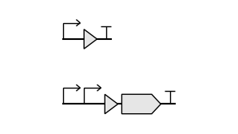
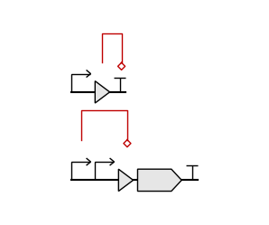
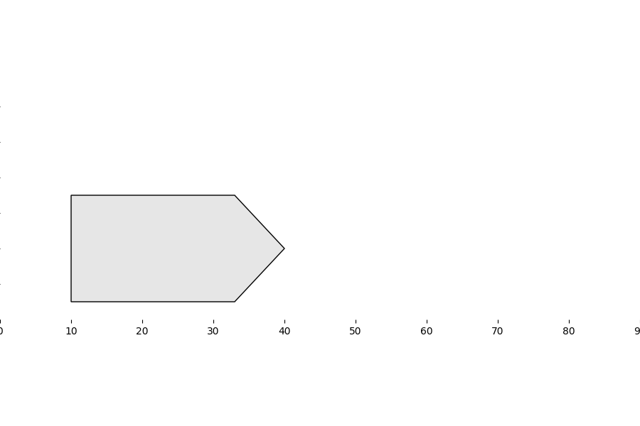
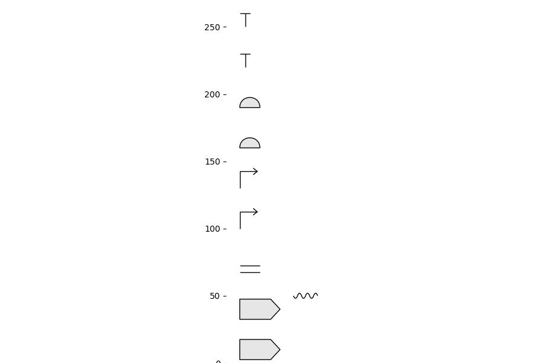
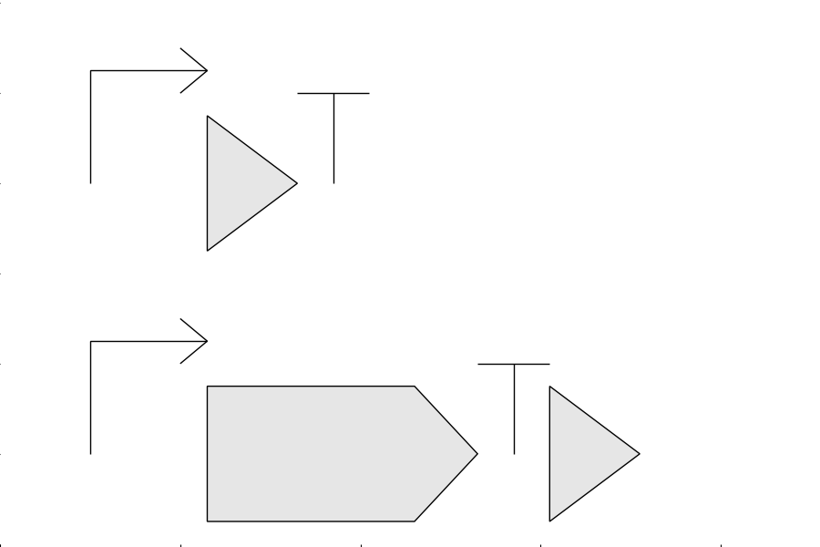

## DNAplotlib2 overview
DNAplotlib is a library that enables highly customizable visualization of individual genetic constructs and libraries of design variants. It can be thought of in many ways as matplotlib for genetic diagrams. Publication quality vector-based output is produced and all aspects of the rendering process can be easily customized or replaced by the user. DNAplotlib is capable of SBOL Visual compliant diagrams in addition to a format able to better illustrate the precise location and length of each genetic part.

## Installation
The DNAplotlib library is contained within the `dnaplotlib2.py` file in the `dnaplotlib2` directory and requires Python 3.6 and matplotlib 1.2 or newer. To install add the location of this file to your `PYTHONPATH` and you are good to: `import dnaplotlib2`

## Data Structure inside DNAplotlib2
The library contains five classes for the storing different components inside sbol3 files and one class to render and draw the biological design.
  
Classes for components are:
- Class BioDesign: Class for collecting and printting all Bio Design components like Backbones, Molecular Species
    and Interactions.
- Class Backbone: class to create backbone (construct) through adding different parts
- Class Part:     class to create a new part (subcomponent) with all components of it
- Class MolecularSpecies:     class to create a new molecular species (dsNA, ssNA, macromolecule, small-molecule)
- Class Interaction:    class to create new interaction between parts, molecules or interaction nodes
- Class InteractionNode:    class to create new list of interaction nodes that connect between different parts
 

Class for Rendering:
- Class Renderer:    class to render biological glyphs and plot them into matplotlib figure using parasbolv library

## Dependencies
- [pySBOL3 library](https://github.com/SynBioDex/pySBOL3): Reading sbol3 files
- [paraSBOLv library](https://github.com/BiocomputeLab/paraSBOLv): Rendering sbol glyphs
- matplotlib library: Visualize the rendered glyphs on a graph

## Library features
- create a biodesgin manually and draw it
- sort parts inside backbone according to start_range on the sequance
- build a hierarchical architecture of different backbones and flatten them 
- draw manually created backbones and molecular species
- read sbol3 file and draw different backbones and molecular species inside sorted according to range location on sequance
- integrate with pysbol3 to read sbol3 files and translate components into dnaplotlib2 data structure
- integrate with parasbolv and matplotlib to draw components stored inside dnaplotlib data structure

## Examples
- draw manually created backbones
 

- draw manually created interactions between every backbone parts
 

- draw specific component inside sbol3 file
 

- draw sbol3 backbones and molecular species
 

- draw backbones with sort manually
 

